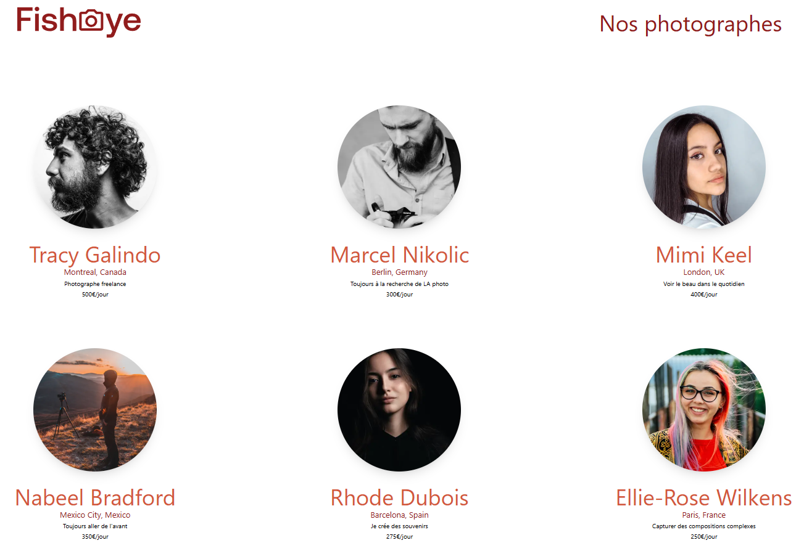

# 📸 Fisheye - Plateforme de Photographes

Bienvenue sur le dépôt du projet **Fisheye**. Ce projet est une application web développée avec **Next.js** qui permet de mettre en avant des profils de photographes et de visualiser leurs œuvres dans une galerie interactive.



## 📋 À propos du projet

Ce site a été conçu dans le cadre d'un parcours de formation OpenClassrooms. L'objectif est de fournir une interface accessible, performante et esthétique pour naviguer parmi les artistes.

### 🛠️ Technologies utilisées

Ce projet repose sur une stack moderne pour assurer performance et maintenabilité :

*   **Next.js 16** (App Router) : Pour la structure de l'application, le routing et le rendu côté serveur (SSR).
*   **React 19** : Pour la construction des interfaces utilisateurs dynamiques.
*   **TailwindCSS 4** : Pour un stylling rapide, maintenable et responsive.
*   **Prisma** : ORM utilisé pour interagir avec la base de données (gestion des photographes et médias).

---

## 🚀 Installation et Lancement

Suivez ces étapes pour installer et lancer le projet localement sur votre machine.

### Prérequis

Assurez-vous d'avoir **Node.js** installé sur votre machine.

### 1. Installation des dépendances

Ouvrez un terminal à la racine du projet et lancez la commande suivante pour installer toutes les librairies nécessaires (listées dans `package.json`) :

```bash
npm install
```

### 2. Configuration de la Base de Données (Prisma)

Le projet utilise **Prisma** (v6) comme ORM. Suivez ces étapes pour le configurer (la version 7 n'est pas compatible) :

**1. Configurer l'environnement**

Créez un fichier `.env` à la racine du projet s'il n'existe pas, et ajoutez-y la ligne suivante :
```env
DATABASE_URL="file:./prisma/dev.db"
```

**2. Installer et initialiser**

Installez Prisma CLI (version 6), générez le client et initialisez la base de données :

```bash
# Installation de Prisma v6
npm install prisma@6 --save-dev

# Génération du client Prisma
npx prisma generate

# Pousser le schéma vers la base de données (crée le fichier dev.db)
npx prisma db push
```

**3. Vérifier l'installation**

Vous pouvez lancer Prisma Studio pour voir si les données et la connexion fonctionnent :
```bash
npx prisma studio
```

### 3. Lancer le serveur de développement

Une fois l'installation terminée, vous pouvez démarrer le serveur local :

```bash
npm run dev
```

L'application sera accessible à l'adresse habituelle : [http://localhost:3000](http://localhost:3000).

---

## 📂 Structure du Projet

Voici comment le code est organisé pour vous aider à vous repérer :

*   **`src/app/`** : C'est le cœur de l'application (Next.js App Router).
    *   `page.js` : La page d'accueil listant les photographes.
    *   `photographer/[slug]/` : Les pages dynamiques pour chaque photographe.
    *   `lib/` : Contient la configuration de Prisma (connexion BDD) et les Server Actions.
    *   `api/` : Routes API Backend (Route Handlers). Elles servent d'interface pour récupérer les données en JSON, utilisées par le frontend ou accessibles de l'extérieur.
*   **`src/components/`** : Contient les composants réutilisables, modulaire pour une meilleure organisation.
    *   `gallery/` : Composants liés à l'affichage des médias (LightBox, Cartes...).
    *   `photographer/` : Composants de profil et d'informations.
*   **`public/`** : Contient les fichiers statiques (images, assets) accessibles publiquement.

---


